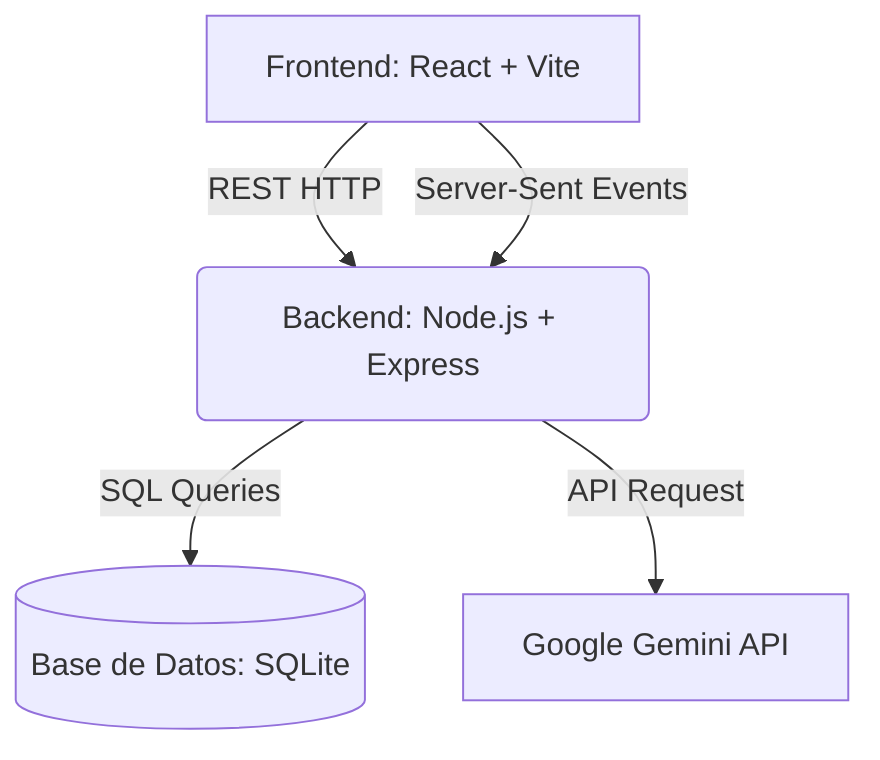

# MEDIQ Perú AI - Copiloto de Triaje Clínico

MEDIQ Perú AI es un sistema de triaje clínico inteligente diseñado para actuar como copiloto en postas médicas y entornos de salud (especialmente en zonas rurales). La plataforma ayuda al personal médico (técnicos, enfermeras y doctores) a registrar pacientes, tomar signos vitales, detectar automáticamente prioridades de atención, e incluye un motor de Inteligencia Artificial que explica los factores de riesgo clínico.

## 🚀 Funcionalidades Principales

*   **Gestión de Pacientes:** Flujo de registro de información personal, localización e idioma del paciente (Español / Quechua).
*   **Triaje Inteligente (Algorítmico):** Motor interno que evalúa signos vitales (SpO2, Temperatura, Presión Arterial, Frecuencia Cardíaca y Respiratoria) cruzado con alertas (dolor, embarazo, convulsiones) para determinar la urgencia (Emergencia, Prioritario, Consulta, Autocuidado).
*   **Explicación con Inteligencia Artificial (Streaming):** Integración con Google Gemini para redactar, en tiempo real, una justificación clínica del nivel de atención asignado y las posibles sospechas diagnósticas del cuadro sintomático.
*   **Generación de Cartas PDF:** Exportación inmediata de una Carta de Referencia Médica con todos los datos tabulados, lista para derivar al paciente a un centro de mayor complejidad.
*   **Soporte Multilingüe (Runasimi):** Traducción on-the-fly al Quechua de las recomendaciones médicas, pensando en la atención rural e inclusiva.

## 🏗️ Arquitectura del Sistema

El sistema está desarrollado usando un enfoque de arquitectura **Cliente-Servidor (Client-Server)** con separación clara entre el Front-End (Vista) y el Back-End (Lógica y Datos):

### 1. Capa de Presentación (Frontend)
Construido como una Single Page Application (SPA). Mantiene estados complejos (como el formulario de 3 pasos) sin recargar la pantalla y consume una conexión persistente bidireccional mediante `EventSource` (SSE) para el efecto "máquina de escribir" de la Inteligencia Artificial.

### 2. Capa de Aplicación (Backend)
Servidor modularizado que expone endpoints RESTful clásicos (`/api/pacientes`, `/api/evaluaciones`) y flujos en Stream (`/api/evaluaciones/:id/explicacion`). Ejecuta los cálculos matemáticos del triaje (Manejo de Glasgow / Alertas Rojas) de forma local antes de solicitar análisis cualitativos a Gemini.

### 3. Capa de Persistencia (Base de Datos)
Motor relacional local embebido (SQLite) diseñado para persistencia ligera y rápida sin configuraciones adicionales de red, ideal para entornos con bajo acceso a internet.

## 🛠️ Tecnologías Utilizadas

### Frontend
*   **React 18:** Librería base para construcción de interfaces de usuario interactivas.
*   **Vite:** Herramienta de compilación rápida y servidor de desarrollo local de alta velocidad.
*   **Tailwind CSS (v4):** Framework CSS de utilidad para construir diseños modernos con rapidez.
*   **Axios:** Cliente HTTP para la comunicación con las rutas REST.
*   **HTML5 EventSource:** Consumo de streams nativo para manejar las respuestas progresivas de la API de IA.
*   **Diseño Visual:** Google Fonts (Atkinson Hyperlegible Next), Material Symbols Outlined.

### Backend
*   **Node.js & Express:** Entorno de ejecución y Framework backend para el enrutamiento.
*   **Better-SQLite3:** Controlador síncrono rápido y eficiente para gestionar la base de datos relacional (SQLite).
*   **Google Gemini SDK (`@google/genai`):** Cliente oficial para comunicarse con el LLM (Gemini 2.5 Flash), obteniendo análisis clínico estructurado en formato stream.
*   **PDFKit:** Generador programático de archivos PDF robustos (cartas de referencia).
*   **Dotenv & Cors:** Manejo de variables de entorno (API Keys) y control de accesos cruzados (CORS).

## 💻 Instalación y Ejecución Local

Para correr este proyecto en tu propia computadora:

1. **Clona o descarga este repositorio** e ingresa a la carpeta raíz.
2. **Configura el Backend:**
    * Entra a la carpeta `/backend`
    * Ejecuta: `npm install`
    * Crea un archivo `.env` y añade tu clave de API de Gemini: `GEMINI_API_KEY=tu_clave_aqui`
    * Ejecuta el servidor: `npm start` (o `node index.js`). El backend correrá en el puerto `3000`.
3. **Configura el Frontend:**
    * Entra a la carpeta `/frontend`
    * Ejecuta: `npm install`
    * Levanta el proyecto: `npm run dev`
    * Abre tu navegador en `http://localhost:5173`

*¡Listo! Podrás probar de inmediato todo el sistema ingresando a la interfaz web con los accesos directos de prueba.*
