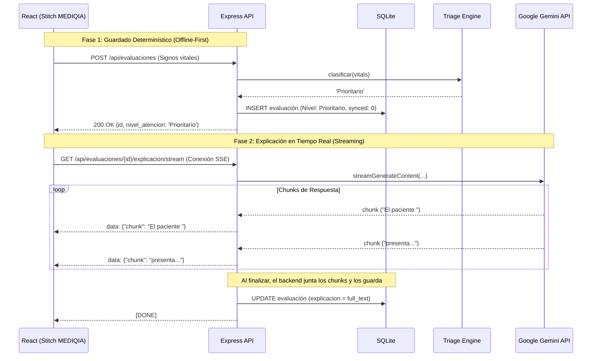

# Implementation Plan: Copiloto de Orientación Clínica (Triaje)

**Branch**: `001-copiloto-triaje` | **Date**: 2026-07-01 | **Spec**: [spec.md](../spec.md)

**Input**: Feature specification from `specs/001-copiloto-triaje/spec.md`

## Summary

Desarrollar un MVP de un Copiloto de Orientación Clínica offline-first. Permitirá registrar pacientes y clasificar urgencias determinísticamente. Utilizará Google Gemini API y Server-Sent Events (SSE) para brindar explicaciones progresivas ("efecto máquina de escribir") en tiempo real a la UI, logrando un TTFT menor a 1s. La interfaz será fiel a los diseños de Stitch ("MEDIQIA").

## Technical Context

**Language/Version**: JavaScript/Node.js (Backend), JS/React (Frontend)

**Primary Dependencies**: Express, React, Vite, Tailwind CSS, `better-sqlite3`, `@google/genai` (Google Gemini API SDK), `pdfkit` (backend).

**Storage**: SQLite local (`better-sqlite3`)

**Architecture Style**: REST para transacciones determinísticas (guardado offline-first) + SSE (Server-Sent Events) para inferencia de IA en tiempo real. Frontend actuando como vista dependiente de Stitch MCP.

## Constitution Check

*GATE: Must pass before Phase 0 research. Re-check after Phase 1 design.*

- [x] **Seguridad clínica**: ¿La clasificación de urgencia está completamente libre de dependencia del LLM?
  *Aprobado: El endpoint `POST /api/evaluaciones` calcula y persiste el triaje sin contactar a Gemini.*
- [x] **Reglas antes que IA**: ¿Las reglas de triaje están aisladas como funciones puras y testeables?
  *Aprobado: `triageEngine.js` es la única fuente de la verdad para el triaje.*
- [x] **Tiempo Real (Streaming)**: ¿Las respuestas de Gemini se sirven mediante streaming a la UI?
  *Aprobado: El diseño introduce endpoints `/stream` basados en Server-Sent Events y llamadas asíncronas por chunks.*
- [x] **Fidelidad de Diseño**: ¿Se está utilizando Stitch MCP para implementar el frontend basado en "MEDIQIA"?
  *Aprobado: React funcionará consumiendo estrictamente estos lineamientos.*
- [x] **Simplicidad y Offline-first**: ¿Se priorizan soluciones locales simples que funcionen sin red, exceptuando la IA?
  *Aprobado: SQLite y persistencia REST antes del streaming cubren el modo offline.*
- [x] **Trazabilidad**: ¿Existe observabilidad clara sobre el motor de reglas y llamadas al LLM?
  *Aprobado: La BD almacena el nivel calculado, y al finalizar el stream se persistirá el resultado de Gemini.*
- [x] **Bilingüismo**: ¿La UI contempla el soporte a quechua como ciudadano de primera clase?
  *Aprobado: Endpoint de traducción en streaming incluido.*
- [x] **Test-first**: ¿Los casos de prueba del triaje están definidos en los requerimientos?
  *Aprobado: Casos de prueba listos en `spec.md`.*

## Project Structure

```text
backend/
├── src/
│   ├── api/
│   │   ├── routes.js             # Definición de endpoints REST y SSE
│   │   └── controllers.js        # Lógica de request/response y chunks
│   ├── core/
│   │   ├── triageEngine.js       # [PURO] Motor de reglas de clasificación
│   │   └── geminiService.js      # Wrapper a Google Gemini con yield/stream
│   └── data/
│       ├── db.js                 # Inicialización SQLite
│       └── schema.sql            # Tablas
└── tests/
    └── triageEngine.test.js      # Unit Tests
    
frontend/
├── src/
│   ├── App.jsx                   # Routing
│   └── (Componentes React + Tailwind diseñados vía Stitch MCP)
```

## Core Modules Design

### `triageEngine.js`
Función pura e independiente que toma parámetros vitales y devuelve (`Emergencia`, `Prioritario`, `Consulta`, `Autocuidado`). Sin dependencias a red ni base de datos.

### `geminiService.js`
Maneja las peticiones a la API de Google Gemini (usando `.streamGenerateContent()`). 
- Expone funciones generadoras asíncronas (`async function*`) para ir devolviendo los `chunks` de texto a medida que llegan desde los servidores de Google.
- Se le inyecta un filtro ligero que cancela la iteración si un chunk forma una palabra prohibida (diagnóstico).

## Architecture Diagram (Mermaid)


